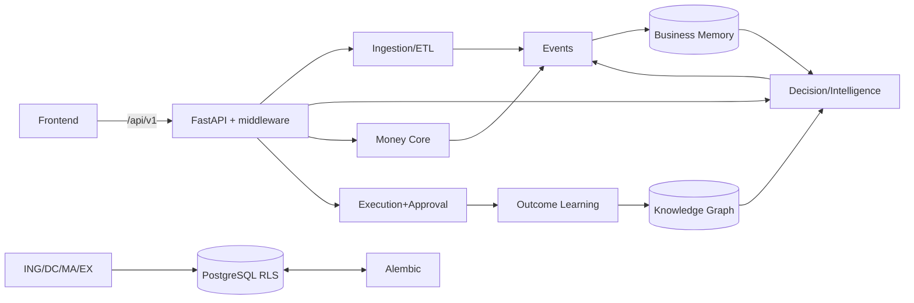

# NazmOS — System Architecture

> Section 34 of the mission brief. High-level topology: layers, components, interfaces, deployment.

## 1. Layered View

```
┌─────────────────────────────────────────────────────────────────────┐
│ FRONTEND (Next.js 15 · `frontend/`)                                │
│  (dashboard) pages: dashboard, upload, inventory(+expiry),          │
│  money-audit, orchestrator, actions, chat, weekly-report            │
│  components: ui/, dashboard/, money-audit/, intelligence/,          │
│  inventory/, pilot/, free/, landing/, layout/                       │
│  lib: api.ts, i18n.tsx (AR/EN), structured-data                     │
└───────────────────────────────┬─────────────────────────────────────┘
                                │  HTTPS /api/v1
┌───────────────────────────────▼─────────────────────────────────────┐
│ API GATEWAY / MIDDLEWARE (FastAPI `app/main.py`)                   │
│  _rls_tenant_context → TenantContextMiddleware asyncio-local        │
│  IdempotencyMiddleware, RateLimitMiddleware, RBAC, business_access  │
│  auth (JWT), security headers, static+mount, 29 routers             │
└───────────────────────────────┬─────────────────────────────────────┘
                                │
        ┌──────────────┬────────┴──────────┬───────────────┐
        ▼              ▼                     ▼              ▼
┌───────────────┐ ┌──────────────────┐ ┌──────────── ┐ ┌─────────────┐
│ INGESTION     │ │ INTELLIGENCE     │ │ MONEY CORE  │ │ EXECUTION   │
│ upload.py     │ │ decision_engine  │ │ money_audit │ │agent_action_│
│ ETL pipeline  │ │ nazm_planner     │ │ recovery_   │ │ executor    │
│ schema_detect │ │ intelligence_api │ │ intelligence│ │ execution_  │
│ normalizer    │ │ ai_gateway       │ │ impact_     │ │ guard       │
│ POS webhooks  │ │ llm_orchestrator │ │ ledger      │ │ action_     │
│               │ │ opencode_brain   │ │             │ │ registry    │
└──────┬────────┘ └────────┬─────────┘ └──────┬──────┘ └──────┬───────┘
       │                   │                  │                │
       ▼                   ▼                  ▼                ▼
┌───────────────────────────────────────────────────────────────────┐
│ EVENTS + LEARNING                                                  │
│  event_engine → business_memory projectors                         │
│  outcome_learning (LearnedOutcome + OutcomeFeedback)               │
│  knowledge_graph projections, learning_reconciliation              │
└───────────────────────────────────────────────────────────────────┘
       ▼
┌───────────────────────────────────────────────────────────────────┐
│ DATA LAYER                                                        │
│  PostgreSQL (RLS via `SET LOCAL app.current_tenant_id`)           │
│  SQLAlchemy async engine · Alembic migrations (40+)                │
│  UUID columns + `types.py` compat · SQLite fallback (demo/tests)   │
└───────────────────────────────────────────────────────────────────┘
       ▼
┌───────────────────────────────────────────────────────────────────┐
│ SIDECARS                                                          │
│  Celery worker+beat (opt-in flags) · Redis (opt-in)               │
│  Provider HTTP: Groq / Gemini / WhatsApp / Foodics / Salla / OAuth│
│  OpenCode CLI subprocess (optional) · POS/backup tooling          │
└───────────────────────────────────────────────────────────────────┘
```

## 2. Router inventory (29r)

Auth, businesses, organizations, inventory, suppliers, upload, audits, money_audit, dashboard, decisions, forecast, compliance, shariah, pharmacies, partners, recovery_match, pilot, subscriptions, oauth, adapters, pos_webhooks, whatsapp, actions, agent, orchestrator, intelligence, chat, events, guest_audit, admin_backup, ops, health.

## 3. Key architectural decisions (verified)

1. **AI is advisory-only.** All AI output passes a deterministic gate (`decision_engine`, `nazm_planner`) and the human approval loop is mandatory unless autonomy explicitly raised. NazmOS, not the model, remains the authority.
2. **Money never floats.** `Decimal` in service + `Numeric(12,2)/Numeric(14,2)` in DB; `utils/money.py`.
3. **Tenant isolation is DB-enforced (RLS)** in addition to query param filtering.
4. **Cell-integrated async**: SQLAlchemy `AsyncSession` throughout; sync paths in Celery tasks where needed.
5. **Graceful degradation**: `USE_CELERY=False`/`USE_REDIS=False` produce in-process fallbacks, so a single Docker app is fully functional.
6. **Event-driven learning**: event stream is the skeleton — projectors (Business Memory) and knowledge graph consume it; transactions/orders/subscriptions emit events.

## 4. Frontend architecture

- Next.js App Router with `(dashboard)` route group gated by auth (`RouteGuard`).
- KPI dashboard, upload + column mapper UI, money-audit (MoneyRecoveryMap, TimeMachine, DecisionComparison, DoNotDoThis), intelligence chat, orchestrator page, admin backup, weekly report.
- i18n AR/EN (i18n.tsx), PWA service worker, structured-data/SEO pages.

## 5. Deployment

- `docker-compose.yml` (staging: Celery+Redis enabled), `.local`, `.sqlite`, `.prod` variants + `backend/Dockerfile`.
- Entry: `main.py` + `celery_app.py`; health check `alive`/`ready`.
- Config in `app/config.py` (pydantic-settings): DB URL, storage, feature flags, provider keys.

## 6. Known architecture-level gaps

1. **No single source of truth for financial measure naming** (legacy vs new columns coexist) → normalization point `recovery_intelligence.py`/`money_audit_service.py`.
2. **Two action-execution paths** (`execution_engine` simulated vs `agent_action_executor` real) — ambiguity in docs; `execution_engine.execute_job` is explicitly simulated (sets `"simulated": True`).
3. **Frontend/backend duplication of scan triggers**: Nazm Planner can be invoked server-side (tasks) or via endpoint; scan orchestration should be central.
4. **Celery only under flag** — scheduled features silently off in default docker.

## 7. Mermaid (compressed)

